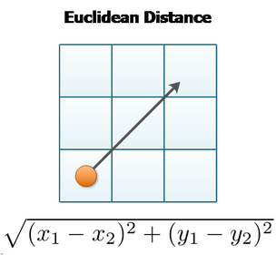
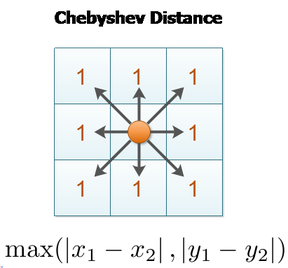
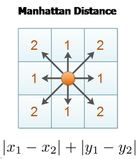

# [Distances](https://lyfat.wordpress.com/2012/05/22/euclidean-vs-chebyshev-vs-manhattan-distance/)

The are at least 3 ways to measure the distance between 2 points:

### Euclidean

Its defined as the length of the line joining two points, given by the known
equation:

### Chebyshev or chess distance

### Manhattan or **L1**

The Manhattan distance is the sum of the absolute differences on the points
coordinates. This can be used as a cost, see the image.
