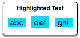

# PDF Viewer

When you select a contiguous block of text in a PDF viewer, the selection is highlighted with a blue rectangle. In this PDF viewer, each word is highlighted independently.
For example:



A list of letter heights in the alphabet will be given and a string. Using the
letter heights determine the area of the rectangle highlight in mm<sup>2</sup>
assuming all letters are 1 mm wide.

For example, the word __torn__ with the next heights respectively: `2,1,1,1`.
The tallest letter is 2 and there are 4 letters. The highlighted area will be
`2*4 = 8mm2` then the expected output is `8`.

## Input format

The first line contains 23 space-separated integers describing the respective
heights of each consecutive lowercase english letter, the second line contains
a single word, consisting og lower case english letters.

## Output format

Print a single interger denoting the area in square milimeters of highlighted
rectangle.


## Eg

### Input:
```
1 3 1 3 1 4 1 3 2 5 5 5 5 5 5 5 5 5 5 5 5 5 5 5 5 5
abc
```
### Output:

```
9
```

The letter heights are a=! , b=3 and c=1. The talles letter is b with 3 mm.
The selection area for this word is `3*1*3 = 9`


- - -

<sub> [src](https://www.hackerrank.com/challenges/designer-pdf-viewer/problem)</sub>