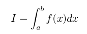
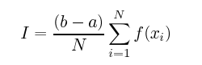
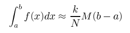
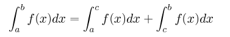
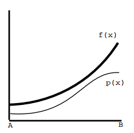
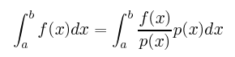

# Monte Carlo Methods

This is a tutorial to try to describe numerical methods that are known as Monte
Carlo methods.

## Basic Description

The Monte Carlo methos provide approximate solutions to a variety of
mathematical problems by performing statistical sampling experiments. They can
be defined as statistical simulation methods, where statistical simulation is
defined as any method that utilizes sequences of random numbers to perform
the simulation.

Monte Carlo methods then involves performing many simulations usign random
numbers and probabilitz to get an approxymation of the answer to the problem.
All the monte carlo methods have in common the use of random numbers in its
approximations, the name of monte carlo comes from the capital of monaco, which
has many casinos and casino roulette whels are an example of random number
generator (citation needed).

This methods existed since the 1940s, but is not until powerful computers
are available that are useful as they can generate accurate aproximations
quickly. Note that this methods only provide an approximation of the answer.
Thus the analysis, then is important to take into account the error when the
answer is evaluated. The attempt to minimize this error is the reason to have
many different monte carlo methods.

## Monte Carlo Techniques:

One of the most important uses of Monte Carlo methods is in evaluating
difficult integrals(multidimensional). Here Monte Carlo gives  reasonable
approximation quicker than other formal techniques.

In the next part each method will be described with its associated error
statistic, four different Monte Carlo methods have their individual
requirements and benefits. Probably the most important is the accuracy of
their approximations as the more accurate the approximation, the less samples
 are needed to reach a specific level of accuracy.

### Crude Monte Carlo
To ilustrate the method we will solve the integral:

A basic description of this method is that a number `N` of random samples
 where each sample `s` is in the range `a <= s <= b` then we find the value
 `f(s)` for the function `f(x)`. We sum all of these values and divide by `N`
 to get the mean value of the samples. Then we multiply this value by the
 interval `(b - a)` to get the integral.

After this is necessary to calculate the uncertainty. (The variance).
Using this information the confidence intervals can be determined and then the
accuracy of the method.

### Acceptance - Rejection Monte Carlo

A basic description, for the interval `(a,b)` find the upper value of `f(x)`
then enclose this interval with a rectangle that is high enough to be above
the upper limit so we can be sure that the entire function for the given
interval is inside the rectangle. Now random points are taken inside the
rectangle and evaluate if the point is below the curve or not. If the point
is below then it is treated as a successful sample. The count of successful
points is now multiplied by the area of the sourrounding rectangle, and that is
the approximation for the integral in the interval `(a,b)`.

Matematically the ratio of the area below the function `f(x)` and the whole
area of the rectangle `Max(f(x) * (b-a))` is aproximately the ratio of the
successful samples `k` and the whole number `N` of samples taken.

To find the accuracy use the variance method.

### Stratified Sampling

The basic principle of this method is to divide the interval `(a,b)` into
subintervals. You then perform a crude monte carlo approximation on each
subinterval.

This technique is well suited if the function to integrate is step like or
has periods of flat. This is because the integration of a sub-interval that
was very flat the obtained variance will be very small. Then this is the
advantage of the stratified sampling method, you get to split the curve into
parts that could have certain advantageous properties when evaluating them
on their own.

### Importance Sampling

in the last 3 methods the probability distribution used was a uniform
distrubution, then if an area of the curve was below the average the samples
there will most likely be counted as un successful. We can do a better
aproximation if we select a better probability distribution which mimics
the shape of the curve.

Then the are with more weight in the measurement
gets more samples. This indeed skews the measurement and it can be counter
productive, but then we add a counter balance to this issue with the next
equation:

Note that the integral of `p(x)` over `(a,b)` is always 1 and for no value of
`x` the function `p(x)` evaluates to 0. Then the accurracy of the aproximation
depends on how well suited is the probability distribution.

## Other applications for the Monte Carlo Techniques

In the examples the monte carlo method was used to evaluate integrals,
however monte carlo can be used to different forms of problems. This example
is fairly simplistic, but ilustrates the method being used from a different
perspective.

In this example we have a coconut shy and we want to determine the probability
taht if we take 10 shots at the coconut shy we will have an even number of
hits. The only fact that we know is that there is a 0.2 probability of having a
hit with a single shot. Monte carlo can be used by performing a large number of
simulations of taking 10 shots at the coconut shy, then count the simulations
that have an even number of hits and put that number over the total of simulat-
ions. This gives us an approximation of the probability of getting an even
number of hits when we take 10 shots at the coconut.

The monte carlo here is to use a random number between 0 and 1 to simulate a
shot at the cononuts. If the random number is between 0 and 0.2 then we can
call it a hit, otherwise we can count it as a loss.

Note that this example is so simple that monte carlo would not be a sensible
choice in this situation because the actual answer can be worked out with much
less effort that a thousand simulations.

http://csep1.phy.ornl.gov/CSEP/MC/MC.html

http://stud4.tuwien.ac.at/

http://wwitch.unl.edu/zeng/joy/mclab/mcintro.html

Book:Introduction to the Monte-Carlo Method
- - -

Technique Vs Method
