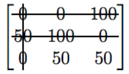

# The assignment problem and the Hungarian Method

### Example:

You work as a sales manager for a toy manufacturer, and currently have three
salespeople on the road meeting buyers. Your sales ppl are in Austin, Boston
and Chicago. You want them to fly to three other cities, Denver, Edmonton,
Alberta and Fargo. The table below shows the cost of airplan tickets:

|From/to |Denver |Edmonton | Fargo |
|------- |:-----:|:-------:|------:|
|Austin  | 250   |**400**  |  350  |
|Boston  | 400   | 600     |**350**|
|Chicago |**200**| 400     |  250  |

Where the salesppl should go in order to minimize the airfare?
With only 3 salespeople is easy to find with trial and error as the numbe of
possible combinations is n!. But in the case of n being a considerable number
help is needed.

**Theorem:** If a number os added or subtracted from all of the entries of any
one row or column of a cost matrix, then the optimal assignment for the 
resulting cost matrix is also optimal assignment for the original cost matrix.

## The Hungarian Method:

This method applies the above theorem to a given _nxn_ cost matrix to find
an optimal assignment.

1. Subtract the smallest entry in each row from all the entries of its row.
2. Subtract the smallest entry in each column from all the entries of its 
column.
3. Draw lines through appropiate rows and columns so that all the zero entries
of the cost matriy are covered and the minimun number of such is used.
4. Test for optimality: 
  1. If the minimum number of covering lines is _n_, an optimal assignment of
  zeros is possible and we are finished.
  2. If the minimum number of covering lines is less than _n_, an optiman
  assignment of zeros is not yet possible. In that case, proceed to step 5.
5. Determine the smalled entry not covered by any line. Subtract this entry
from each uncovered row, and then add it to each covered column. Return to 
step 3.

### Example Cont.

#### Step 1: 
Subtract 250 from row 1, 350 from row 2, and 200 from row 3

|       |         |       |    |       |         |       |
|:-----:|:-------:|------:|---:|:-----:|:-------:|------:|
| 250   |  400    |  350  | -> |   0   |  150    |  100  |
| 400   | 600     |  350  | -> |  50   | 250     |   0   |
|  200  | 400     |  250  | -> |   0   | 200     |   50  |

#### Step 2: 
Subtract 0 from col 1, 150 from col 2 and 0 from col 3

|       |         |       |    |       |         |       |
|:-----:|:-------:|------:|---:|:-----:|:-------:|------:|
|   0   |  150    |  100  | -> |   0   |    0    |  100  |
|  50   | 250     |   0   | -> |  50   | 100     |   0   |
|   0   | 200     |   50  | -> |   0   |  50     |   50  |

#### Step 3: 
Cover all zeros of the matrix with the minimum number of horizontal or vertical
lines

#### Step 4:

since the minimal number of lines is 3 an optimal assignment of zeros is possible
and we are done. Since the total cost for this assignment is 0, it must be an
optimal assignment,

|       |         |       |
|:-----:|:-------:|------:|
|   0   |  **0**  |  100  |
|  50   | 100     | **0** |
| **0** |  50     |   50  |

Here is the same assignment made to the original cost matrix.

|       |         |       |
|:-----:|:-------:|------:|
| 250   |**400**  |  350  |
| 400   | 600     |**350**|
|**200**| 400     |  250  |
