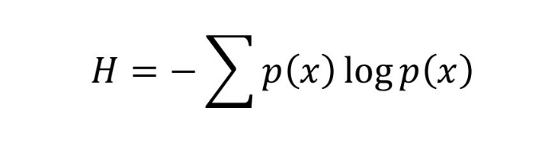
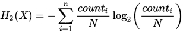
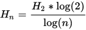
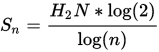

# Entropy

For the purpose of strings and more related compsci the definition of
entropy is "a measure of uncertainty in a random variable". For most
things the entropy is calculated using the Shannon Entropy formula:



This measures the randommnes of the string. In general terms, entropy is
a measure of how much information there is in one source with one
probability distribution.


For the specific case of entropy in strings calculate the shannon entropy
<b><i>H</i></b> of a given input string with a known encoding.
Given the discrete random variable <b><i>X</i></b> that is a string of
<b><i>N</i></b> "symbols" in this case the symbols are characters in the
alphabeth, which consists of n different characters. (n=2 for binary) the
shannon entropy for X in bits/symbols is



Where **<i>count<sub>i</sub></i>** is the count of characters **n<sub>i</sub>**

In this example **X**="11223334444". The resulting entropy should be `1.86644`
bits/symbols. This assumes X was a random variable, which may not be the case,
or it may depend on the observer (?). This measures the amount en entropy
taking as universe of allowed symbols only the symbols in the present string.
For example in "11223334444" N = 4. and count<sub>i</sub> is:
For pair element : count
```
1:1
2:2
3:3
4:4
```

This formula calculates the __specific__ or __intensive__ entropy that finds
parallel in physics with the specific entropy S<sup>0</sup> which is entropy
per kg or per mole, not like physical entropy S and therefore not the information
content of a file. It comes from Boltzmann H-theorem where <b><i>S = k<sub>B</sub>NH</i></b>
where N=number of molecules. Boltzmann H is the same equation as Shannons H and
it gives the specific entropy H in a Per molecules basis.

The total or extensive information entropy is:

<b><i>S = H<sub>2</sub>N</i></b> bits

This is not the entropy we are calculating here, but is the closest to physical
entropy and a measure of the information content of a string. But it does not
look for any patterns that might be available for compression, so its a very
restricted, basic, and certain measure of information. Every binary file with
an equal number of 1's and 0's will have S=N bits (Entropy S equals number of bits).
All Hex files with equal symbol frequencies will have <b><i>S = N log<sub>s</sub>16</i></b>
bits of entropy.

The H function does not look for any pattern in data or check if X was a random
variable. For example X = `000000111111` gives the same calculated entropy in
all senses as Y = `010011100101`. For most purposes it's usually more relevant
to divide the gzip length by the length of the original data to get informal
measure of how much "order" was in the data.

Other measures of entropy:

#### Normalized specific entropy:



This gives a value from 0 to 1 and it has units "Entropy/symbol" or 1/symbol.

#### Normalized total (extensive) entropy:



This gives a value from 0 to N and does not have units. It is simple the "entropy"
but it needs to be called "total normalized extensive entropy" so that is not
confused with Shannons (specific) entropy.


Relative entropy is a measure of how close or distant one probability
distribution is to another.

## Samples
```
1223334444
1.84644

the lazy fox jump over brown dog
4.14032

D97Ad7AZSD8A7dhA7FAfF8FHASFUHASDFUAH87ZSF
3,12278

345B2345C2345C234T25C324345C23Z24WERS FDDGBNHJKTUZTERFDGNHJM,MTNBFVSDCGRWE
4.33509

oownya8+1CCn'rWf3$akopQ2Qx@1X3IU:k%6>3"i*!hCBS\~p|mIM/'qmD$@;&d
5.17523
```


 - - -
https://planetcalc.com/2476/
