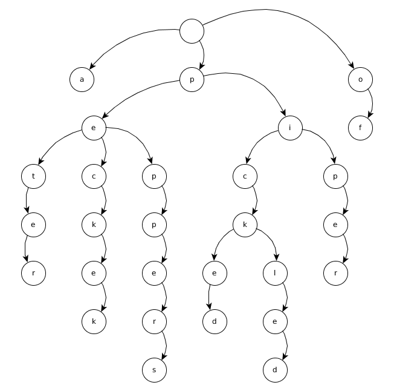
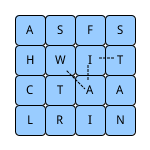

# Trie

A trie is a data structure, primarly desgined for strings, it is similar to trees,
but it is different in its usage and application.

- The first node is null in value, not in reference
- Each element contains a reference to every possible child, even if the reference
 is null
- Then, the size of a trie is directly proportional to the alphabet used.

The term trie comes from the word retrieval citation needed and usually is
pronounced __try__  to distinguish from tree.

The worst case runtime if a trie is `O(n+m)` where:

- `m`:  the longest key in the trie
- `n`:  Total number of keys

## Diff trie vs tree

A trie is basicall a tree data structure, but has a few rules to follow in terms of
how is created and used.

## Example:

Create a trie to contain the rhym: __peter piper picked a oecj of picked peppers__

## Other example

Find all the valid words in a `4x4` letter board, connecting adjacent letters
horizontally, vertically or diagonally.

 [src](https://www.toptal.com/java/the-trie-a-neglected-data-structure)</src>